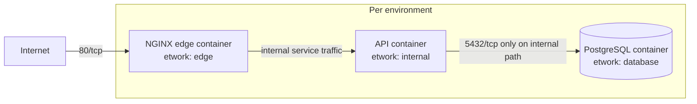

# Terraform Assessment

This repository implements Path A: a Docker-based local infrastructure stack that models a realistic web application with isolated network tiers, a reusable Terraform module, and environment-specific state management.

## Path taken

Path A was selected.

This means the architecture is modeled locally with Docker primitives:

- `edge` network = public-facing ingress tier
- `internal` network = private compute tier
- `database` network = isolated database tier

The backend is a MinIO S3-compatible object store running inside the local Docker Compose stack. Terraform uses that MinIO service as its remote backend with locking enabled.

## Architecture diagram


## AWS design mapping (design-only)
## AWS architecture (design-only)

As required for **Path A**, this repository includes a design-only AWS architecture showing how the local Docker implementation maps to AWS services. No AWS resources are deployed as part of this project.

The document includes:

- A target AWS architecture diagram
- Mapping from local Docker primitives to AWS services
- Network segmentation across public and private subnets
- Database isolation using private subnets and Security Groups
- Remote Terraform state using Amazon S3
- GitHub Actions authentication using OIDC
- Notes on how the Terraform module would be adapted to target AWS

See:

- [AWS Architecture Design](aws-architecture-design.md)

### Local primitive → AWS equivalent

- `edge` Docker network → public subnet + ALB/public entry point
- `internal` Docker network → private subnet + compute security group
- `database` Docker network → private database subnet + RDS security group
- PostgreSQL container → Amazon RDS for PostgreSQL
- MinIO state backend → Amazon S3 remote state + DynamoDB locking
- `TF_VAR_db_password` → Secrets Manager or SSM Parameter Store
- CI runner credentials → GitHub OIDC role with short-lived AWS credentials

### DB isolation on AWS

The same isolation rule is enforced with network and security-group boundaries:

- the RDS security group allows ingress only from the compute service security group
- the compute service is placed only in private subnets
- no public IP is attached to the database tier
- the ALB/public entry point is not allowed to reach RDS directly

Verification would be done by checking that the compute task can resolve and connect to the RDS endpoint, while the public ALB or edge service cannot connect to that same endpoint.

### Module boundary note

The local Terraform module is not Docker-specific in concept. To target AWS, the same module boundary can stay intact by swapping providers and changing the inputs:

- replace the Docker provider with AWS providers for VPC, ECS, ALB, and RDS
- replace container-specific inputs with service/task and subnet/security-group inputs
- keep the environment pattern the same: staging and production remain two instantiations over the same reusable module

No AWS deployment is performed here; this is a design-only mapping for the Path A architecture.

## Local run / activation

### 1. Start the local backend

```bash
docker compose up  
### from the root directory containing the compose file 
```

### 2. Initialize Terraform

```bash
terraform init -reconfigure
```

### 3. Set the database secret locally

The repository does not store the database password in plaintext. Supply it through an environment variable before running Terraform:

```bash
export TF_VAR_db_password="your-secret"
```

### 4. Run the environment

```bash
cd environments/staging
terraform plan
terraform apply
```

For production, use the production environment directory and a separate secret value.

## Repo secrets for GitHub Actions

To activate the CI pipeline in GitHub:

1. Add a environment secret named `TF_VAR_DB_PASSWORD`.
2. Ensure the workflow has access to that secret through the GitHub Environment or repository settings.
3. Keep the workflow permissions minimal:
   - `contents: read`
   - `pull-requests: write` 

## Environment segregation and remote state + locking

The repository uses a single reusable module in [modules/app/main.tf](modules/app/main.tf) and two environment entrypoints:

- [environments/staging/main.tf](environments/staging/main.tf)
- [environments/production/main.tf](environments/production/main.tf)

This satisfies DRY and environment segregation because staging and production are instantiated from the same module with different inputs, while state is kept isolated per environment directory.

State is stored remotely in MinIO, which is started from the local Docker Compose file. The backend is S3-compatible and uses a lock file (`use_lockfile = true`) for locking during state operations.

## Database isolation enforcement

The database isolation is enforced in the Terraform module by assigning each service to a different Docker network:

- `edge` network: NGINX only
- `internal` network: API only
- `database` network: PostgreSQL only

This means:

- the public edge service cannot reach the database directly
- the API service is the only compute tier that has a path to the database
- no public ingress is assigned to PostgreSQL

## How isolation was verified

A reproducible verification target is included in [Makefile](Makefile) and [VERIFY.md](VERIFY.md):

```bash
make verify
```

The script in [scripts/verify-isolation.sh](scripts/verify-isolation.sh) performs two checks:

1. From the compute tier (`staging-api`), it probes the PostgreSQL port `5432` and expects success.
2. From the edge tier (`staging-nginx`), it retries the same port and expects failure.

That gives a concrete proof of isolation without exposing PostgreSQL to the public edge tier.

## Repository structure

- [modules/app/main.tf](modules/app/main.tf) — reusable application stack module
- [environments/staging](environments/staging) — staging deployment inputs
- [environments/production](environments/production) — production deployment inputs
- [bootstrap](bootstrap) — backend bootstrap helper scripts
- [.github/workflows/terraform-pr.yml](.github/workflows/terraform-pr.yml) — PR validation workflow
- [.github/workflows/terraform-merge.yml](.github/workflows/terraform-merge.yml) — merge-to-main apply workflow
- [scripts](scripts) - contains shell to verify isolations

# Submission

## Repository

GitHub Repository: **https://github.com/gkasamoah/terraform-devops-assesment.git**

**Path implemented:** **Path A – Local Docker Infrastructure**

This repository contains a complete Terraform implementation using Docker to model a production-style infrastructure with:

* A reusable Terraform module
* Separate staging and production environments
* Remote Terraform state using MinIO (S3-compatible backend)
* Network isolation between the edge, application, and database tiers
* GitHub Actions CI/CD for validation, planning, and deployment
* Design-only AWS architecture documentation showing how the same solution maps to AWS services

The README contains the information required to understand the architecture, bootstrap the backend, deploy the infrastructure, and run the verification steps without additional guidance.

## Pipeline

The GitHub Actions workflows implement the following:

* Pull Request validation (`terraform fmt -check`, `terraform validate`, static analysis, backend bootstrap, `terraform plan`, and PR plan comments)
* Merge-to-main deployment using `terraform apply`
* Manual approval through a protected GitHub Environment
* Least-privilege workflow permissions
* Third-party GitHub Actions pinned to commit SHAs

## Timeboxing

The implementation focused on delivering the required functionality and documentation for Path A.

If additional time were available, the next improvements would be:

* Add automated integration tests that verify network isolation after deployment.
* Expand the verification scripts to include additional health and connectivity checks.
* Add scheduled drift detection using `terraform plan`.
* Strengthen the CI/CD pipeline with provider caching, concurrency controls, and additional security scanning.
* Extend the Terraform modules to support both Docker and AWS providers through a common module interface.
