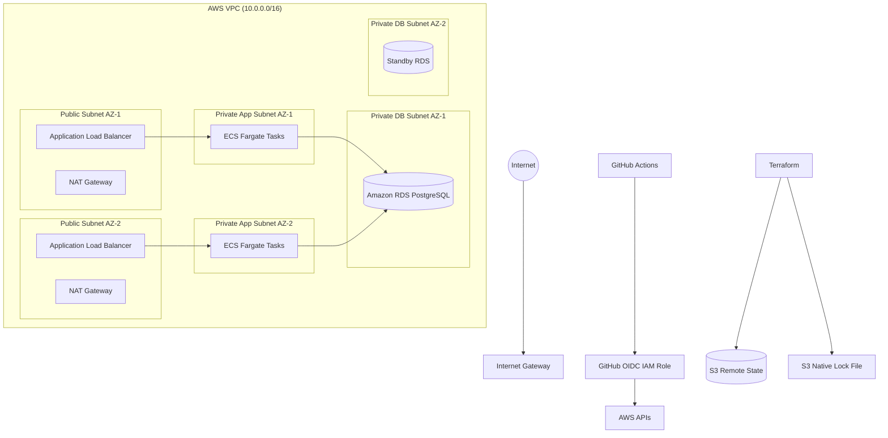

# AWS Architecture Design (Path A Mapping)

## Overview

The local implementation uses Docker networks and containers to simulate a production cloud environment. This section demonstrates how the same infrastructure would be deployed on AWS while maintaining the same security model, network segmentation, Terraform module structure, and CI/CD workflow.

---

# AWS Target Architecture



---

# Network Design

The AWS deployment uses a dedicated Virtual Private Cloud (VPC) with isolated public and private subnets distributed across two Availability Zones for high availability.

## Public Tier

Resources:

- Internet Gateway
- Application Load Balancer
- NAT Gateways

Responsibilities:

- Accept incoming HTTPS traffic
- Route traffic to the application tier
- Provide outbound Internet access for private resources through NAT

---

## Private Application Tier

Resources:

- ECS Fargate Service
- API containers

Responsibilities:

- Receive traffic only from the ALB
- Process business logic
- Connect to the PostgreSQL database

Application tasks do not receive public IP addresses.

---

## Database Tier

Resources:

- Amazon RDS PostgreSQL (Multi-AZ)

Responsibilities:

- Store application data
- Accept traffic only from the ECS Security Group
- Never exposed to the Internet

The database is deployed into dedicated private database subnets.

---

# Security Groups

## Application Load Balancer Security Group

Ingress

- TCP 80 (optional redirect)
- TCP 443 from Internet

Egress

- TCP application port to ECS Security Group

---

## ECS Security Group

Ingress

- Application port only from the ALB Security Group

Egress

- PostgreSQL (5432) to RDS Security Group
- HTTPS (443) to Internet through NAT for updates and package downloads

---

## RDS Security Group

Ingress

- PostgreSQL (5432) **only** from ECS Security Group

Egress

- Default outbound

No inbound traffic from:

- Internet
- ALB
- Public Subnets

---

# Terraform Remote State

The Docker implementation stores Terraform state in MinIO.

AWS equivalent:

- Amazon S3 Bucket
- Native S3 Lock File (`use_lockfile = true`)
- Bucket Versioning Enabled
- Server-side Encryption Enabled


Each environment maintains an independent state file to prevent accidental cross-environment changes.

---

# Secrets Management

Local implementation

```
TF_VAR_db_password
```

AWS equivalent

- AWS Secrets Manager
or
- AWS Systems Manager Parameter Store (SecureString)

Application tasks retrieve the secret using an IAM Task Role instead of embedding credentials inside Terraform code or container images.

---

# GitHub Actions Authentication

Local implementation

```
No cloud authentication required
```

AWS implementation

GitHub Actions authenticates using OpenID Connect (OIDC).

Flow:

GitHub Actions

↓

OIDC Identity Token

↓

AWS IAM Role

↓

Temporary AWS Credentials

↓

Terraform Apply

Advantages:

- No long-lived AWS Access Keys
- Temporary credentials
- Least privilege access
- Automatic credential rotation

---

# Local-to-AWS Mapping

| Local Infrastructure | AWS Equivalent |
|----------------------|----------------|
| Docker Edge Network | Public Subnets |
| Docker Internal Network | Private Application Subnets |
| Docker Volume | Amazon EBS Storage |
| Nginx Container | Application Load Balancer |
| API Container | Amazon ECS Fargate Service |
| PostgreSQL Container | Amazon RDS PostgreSQL |
| Docker Network Isolation | Security Groups |
| Docker Compose | ECS Service Definition |
| MinIO | Amazon S3 |
| Local Lock File | S3 Native Lock File |
| TF_VAR_db_password | AWS Secrets Manager / SSM Parameter Store |
| Docker Host | Amazon VPC |
| GitHub Local Credentials | GitHub OIDC IAM Role |

---

# Database Isolation

Database isolation is enforced using both network segmentation and security groups.

Controls:

- RDS is deployed into private database subnets.
- RDS has no public IP address.
- The RDS Security Group allows PostgreSQL traffic only from the ECS Security Group.
- The Application Load Balancer has no direct route to the database.
- Internet traffic cannot reach the database because no public subnet or route exists.

# Verification Strategy

The following checks would verify database isolation after deployment.

## Verify ALB Access

```
curl https://application.example.com
```

Expected:

```
HTTP 200
```

---

## Verify ECS Can Reach RDS

```
psql \
-h database.endpoint.amazonaws.com \
-U appuser
```

Expected:

```
Successful connection
```

---

## Verify Internet Cannot Reach Database

```
nc database.endpoint.amazonaws.com 5432
```

Expected:

```
Connection timed out
```

---

## Verify Security Groups

Confirm:

- ECS Security Group is the only allowed source in the RDS Security Group.
- No inbound rules reference `0.0.0.0/0`.
- RDS has no public IP.
- Database subnet route tables contain no Internet Gateway route.

---

# Terraform Module Boundary

The Terraform module is intentionally designed to be provider-agnostic.

Only the infrastructure resources change between the Docker and AWS implementations.

## Docker Module

Resources

- docker_network
- docker_container
- docker_volume

---

## AWS Module

Resources

- aws_vpc
- aws_subnet
- aws_security_group
- aws_lb
- aws_ecs_cluster
- aws_ecs_service
- aws_db_instance

The module interface remains largely unchanged. Inputs such as `environment`, `db_password`, image names, resource sizing, and replica counts are reused, while the provider-specific resources are swapped. This keeps the module reusable across local Docker and AWS without changing how environments consume it.

---
